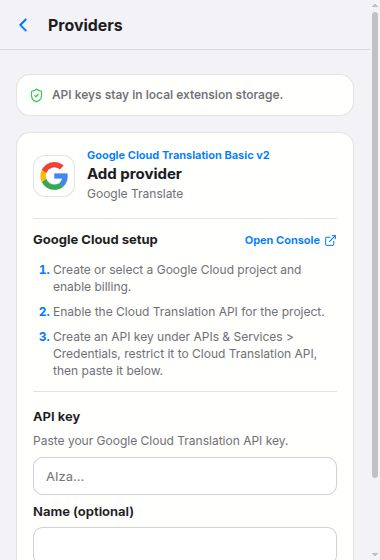
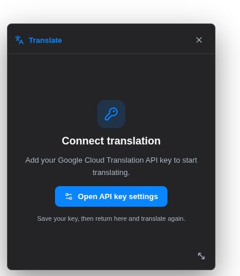
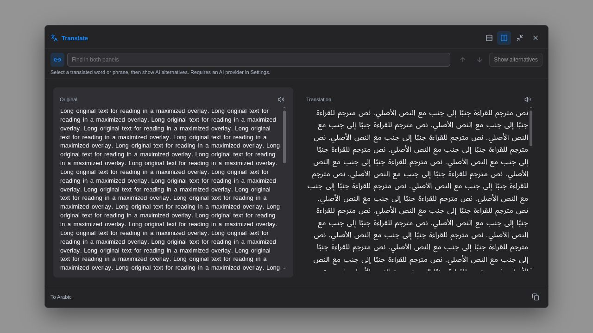

# Translation extension UX review

Reviewed September 26, 2026. Scope: toolbar translation, provider setup, missing-key recovery, and the expanded reader. Screenshots use the current built UI with synthetic text and mocked extension APIs; no real keys or paid requests were used. This is a local UI review, not a live Firefox integration or full accessibility audit. No production code was changed during this review.

## 1. Toolbar translator — clear structure, weak feedback

The original and translation panels are easy to distinguish, and the compact expand icon fits the other actions.

- **Medium: confirm copying.** Clicking Copy produces no visible success or failure feedback. Briefly change the icon to a checkmark and announce “Copied” through a status region; show a recoverable error if copying fails.
- **Medium: expose the text limit.** Neither input displays the 15,000-character maximum. The textarea enforces a maximum and input handling slices pasted text. Add a small character counter and an explicit message when pasted text exceeds the limit, so omitted text is not overlooked.
- **Polish: make icon controls easier to target.** DOM measurements show 24 × 24 px controls. Increase their hit areas to about 30–32 px while keeping the glyphs compact, and improve the visual emphasis of enabled actions. This is a usability recommendation, not a claimed WCAG violation.
- The top Translate label truncates to “Trans…” at the normal popup width. Give it enough space or shorten the label without changing its accessible name.

## 2. Provider settings — useful guidance, a confirmed labeling bug

The Google Cloud setup steps and local-storage note explain the setup well. The form extends below the popup viewport, pushing Save out of the initial view.

- **High: fix field associations.** DOM inspection found the same generated ID on the API-key password field and optional-name text field. Both visible labels associate with the password field; the accessibility snapshot names both textboxes “API key.” Put each control in its own Field.Root with a unique ID and matching label.
- **Medium: keep Save reachable.** Use a sticky Save/Cancel footer and collapse the long setup guide once the user is entering a key.
- **Medium: offer key verification.** Add an optional “Test connection” action with a clear success/error state. Saving a nonempty key currently does not establish that it works. Verification would make an API call and should be explicit.

## 3. Missing-key recovery — much clearer, but not a complete return path

The centered key icon, short explanation, and settings button make the next step clear.

- **High: add Retry after setup.** The prompt tells users to return and translate again, but provides no Retry button. Keep the selected text and offer “Try again” after settings are saved, without requiring another selection.
- Use the same actionable pattern for invalid credentials, network failures, and quota errors, with a relevant action for each.
- The settings-window launch and persistence of a real saved key were not exercised against Firefox in this review.

## 4. Expanded reader — good reading layout, crowded interaction model

Side-by-side panels, independent text directions, search, and linked scrolling provide a solid reading surface.

- **High: reduce keyboard stops.** The sample original panel exposed 720 word buttons, and the implementation assigns tabIndex=0 to each. Use a single keyboard entry point with arrow-key word navigation, or a separate word-selection mode, so Tab can reach the reader controls efficiently.
- **Medium: simplify alternatives discovery.** The disabled action and permanent explanatory sentence consume toolbar space. Use a short “Select translated text for alternatives” hint, show the selected phrase when relevant, and offer provider setup directly when no AI key is configured.
- **Low: improve empty search feedback.** Searching for an absent phrase reports “0 of 0.” “No matches” communicates the state more directly.

## Recommended implementation order

1. Fix provider field labels and reader keyboard navigation.
2. Add a Retry path that preserves the selected text after setup/errors.
3. Add copy confirmation and character-limit feedback.
4. Polish provider forms and alternatives discovery.

## Evidence limits

Screenshots were captured from current components in a local preview. Translation responses and browser APIs were mocked. Dark reader and light toolbar/settings were inspected; this was not a full theme, screen-reader, touch, browser, or zoom matrix. Contrast ratios were not measured. An additional draft-navigation check timed out, so draft persistence is not reported as a confirmed finding.
